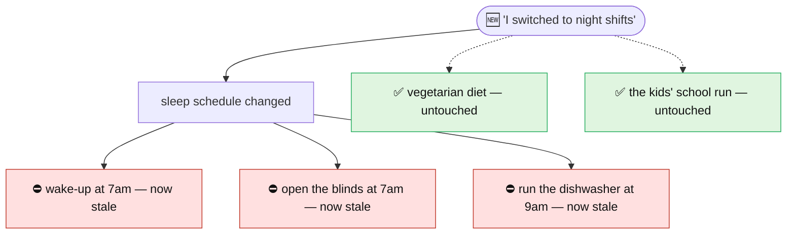

# GEM — Governed Evolving Memory

**The long-term goal: Personal & Home Intelligence** — an AI that genuinely *knows you* and stays
*right* as your life changes. GEM is a **building block toward that goal**: the memory layer that
keeps a personal/home AI's facts consistent when one of them changes.

> The hard part of a personal or home AI isn't *remembering* facts — it's keeping their
> **consequences** consistent when one changes. Every assistant today can store a new fact; none
> updates everything that *depended* on the old one. GEM is that missing piece: **memory that
> updates its own downstream consequences, automatically.** This repository is an early
> **research build** of that layer.

---

## Why this matters

A personal or home AI accumulates thousands of interlinked facts about you. *Remembering* them is
easy. Keeping them **consistent when your life changes** is the unsolved part — because one change
*ripples*.

**Example — home intelligence.** You tell your home AI: *"I've switched to night shifts."* A normal
assistant just stores it. GEM cascades the consequences, and prunes what's unaffected:



**Update what changed, leave the rest alone.** That selective ripple is what makes a memory
*trustworthy enough to act on* — the line between an assistant that feels intelligent and one that
confidently does the wrong thing (throwing the blinds open while you're trying to sleep).

## The breakthrough

Flat / vector memory — what every assistant uses today (Mem0, ChatGPT memory, plain RAG) — only
re-checks facts that are **textually similar** to a change. *"I switched to night shifts"* isn't
similar to *"open the blinds at 7am,"* so flat memory never connects them and serves the stale
routine. **GEM links them with an explicit `DERIVED_FROM` dependency edge and walks it** — catching
consequences that similarity search is *structurally blind* to.

```text
Facts handled correctly on derived-fact chains      (measured, pre-registered protocol)

  GEM    ███████████████████████████   100%   (37 / 37)
  flat   ██████████████████▌            68%   (25 / 37)
                                          └── +27 points fewer stale-fact errors
```

## Status — research build (with real, measured scores)

An early **research build by Revanth Darshan** of the memory layer above — a working prototype, not
a finished product. And yes: it already has **measured headline scores**, not just a pitch — each
from a reproducible experiment (artifacts in [runs/](runs/)):

- 🧠 **Multi-hop cascade works** — 100% (12/12 scenarios, 37/37 facts) across deep, cross-domain
  tests: medical, legal, finance, multi-parent dependency graphs, and 6-hop chains.
- 📊 **+27 points more accurate** than flat/vector memory on derived-fact chains (the chart above).
- 🪨 **Model-robust** — 83% on the deep-dependency test suite on *both* a 120B *and* an 8B model.
- 🎯 **97% SubEM** fact-resolution on a real benchmark gate (vs a ~60% reference target).
- 📦 **Usable library** — `from gem import Memory`, pip-installable, **47 offline tests + CI**.
- 🔬 **Positioned honestly against the field** — *measured* head-to-head vs **Mem0**; *architectural*
  comparison vs **Zep** and the academic incumbent (**STALE / CUPMem**). A live GEM-vs-CUPMem run on
  the real STALE benchmark is the **next experiment — not done yet.**

```text
Deep-dependency test suite (hardest cases), accuracy by model size

  120B model   █████████████████████   83%
  8B  model    █████████████████████   83%    ← holds up even on a small model
```

### Experiments run so far

The numbers above come from these kinds of experiments — the methodology and raw outputs are in
the linked docs and [runs/](runs/):

- **Gate** — can a commodity open model extract facts and resolve single-hop conflicts on a *real*
  benchmark? → 97% SubEM. ([`runs/gate_*`](runs/))
- **Cascade correctness** — hand-built deep scenarios across medical, legal, finance, multi-parent
  dependency graphs, and 6-hop chains → 100% (12/12, 37/37). (`gem/eval_diverse.py`)
- **Head-to-head vs flat/vector memory** — a *pre-registered* protocol measuring stale-fact errors,
  retrieval-blindness, and per-write cost → +27 points. ([BASELINE_PROTOCOL.md](BASELINE_PROTOCOL.md))
- **Cross-model robustness** — the deep-dependency suite re-run on a 120B *and* an 8B model → 83% on
  both.
- **Field positioning** — *measured* head-to-head vs **Mem0** on the propagation eval
  ([RELATED_WORK.md](RELATED_WORK.md)); *architectural* comparison vs **Zep** (same doc) and the
  academic **STALE / CUPMem** work, for which the eval harness is built
  ([stale_eval/FINDINGS.md](stale_eval/FINDINGS.md)). The **live GEM-vs-CUPMem run on the real
  STALE benchmark is the open next step — not yet done.**
- **Mechanism ablations** — six alternative invalidation designs were built and tested (lazy,
  graph-guided, anchor-stamping, …); the eager dependency-cascade held up as the robust core.
- **Cost & determinism** — per-write call counts, a similarity-gate that cuts scan cost ~88% with no
  accuracy loss, and run-to-run variance. ([PRODUCTIONIZATION.md](PRODUCTIONIZATION.md))

> Honest limitations and the productionization gaps are documented alongside the wins — this is a
> research build, and it says so.

---

## How it works

When a fact changes, the facts **derived from it** go stale automatically — down a typed
dependency chain, multi-hop — while unrelated facts survive. A flat/vector memory (Mem0, ChatGPT
memory, plain RAG) re-examines only what *similarity search* surfaces, so a dependent that isn't
textually similar to the change is served **stale and confidently**. GEM re-examines it via the
dependency edge instead.

```bash
pip install -e .                 # core (numpy + an LLM client)
pip install -e ".[embeddings]"   # recommended: semantic embeddings (sentence-transformers + faiss)
```

```python
from gem import Memory

m = Memory()                                            # cascade on by default
auth = m.add("Auth uses JWT bearer tokens").id
m.add("Tests mock the JWT verifier", derived_from=[auth])
m.add("CI requires a JWT_SECRET env var", derived_from=[auth])

r = m.add("We migrated auth from JWT to session cookies")
r.invalidated      # derived facts now flagged stale (don't trust)
r.revised          # derived facts auto-corrected in place (still usable)

m.search("how do tests authenticate?")                  # ACTIVE facts only — stale ones withheld
```

> **`Memory.add()` / `search()` call an LLM**, so the snippet above needs a model: point
> `OLLAMA_HOST` at an [Ollama](https://ollama.com) server (default model `gpt-oss:120b-cloud`),
> or set `GEM_LLM=groq` with a `GROQ_API_KEY`.
>
> **No model handy? You can still verify the entire cascade engine offline** — the test suite
> uses a mock LLM + mock embedder, so it needs no network and no API key:
>
> ```bash
> pip install -e ".[dev]"
> pytest          # 47 tests exercise the full cascade (multi-hop, semantic stop, cycle guard, …)
> ```

**See it separate from flat memory** (`python -m gem.quickstart`, saved in
[runs/quickstart_demo.txt](runs/quickstart_demo.txt)): a billing service is reassigned from the
Payments team to a new Revenue team. Flat memory corrects the facts textually close to the
change but leaves *"deploy approval requires a **Payments** team reviewer"* stale — so the agent
routes the approval to a team that no longer owns the service. GEM cascades the ownership change
and corrects all three downstream process facts.

### Use it when… / skip it when… (the honest scope — measured, not asserted)

| Use GEM when | Skip GEM when |
|---|---|
| memory drives **actions** off **chains of derived facts** | facts are **flat & atomic** (preferences, profile fields) — no chains, pure overhead |
| **reads ≫ writes** (pay the cascade once at write, not staleness every read) | **write-heavy / rarely-read** memory |
| a silent stale fact is **expensive** (ops, compliance, agent tool-calls) | a wrong-but-cheap answer is tolerable |

Measured trade (`runs/gap_experiment.txt`): on derived-chain scenarios GEM scores **37/37 vs
flat's 25–27/37** (+27pts), at **+57% LLM calls** (~1.8 calls per recovered stale fact) — and
the cost is **scoped to the affected dependency subgraph, not memory size** (zero extra calls on
unrelated writes). GEM converts a permanent per-query **correctness** liability into a bounded
one-time per-write **compute** cost. By default it **auto-corrects** derived facts; pass
`Memory(conservative=True)` to instead flag them `STALE + needs_review` for human reconfirmation
(recommended when a weaker model drives the cascade). Where the table's right column applies,
flat memory wins outright — this is a targeted tool, not a general memory replacement.

**Explicit vs inferred dependencies.** `add(fact, derived_from=[ids])` pins the dependency edges
exactly. Omit `derived_from` and GEM infers them — convenient, and **validated across 12 domains
at ~85–88% recall / ~75–84% precision** (`runs/diag_derive_diverse.txt`), but best-effort: a
minority of cascades may be missed or spurious. **Pin the dependencies you can't afford to get
wrong; let the rest infer.** (`python -m gem.diag derive [N]` reproduces the recall number;
`python -m gem.diag edges` proves hard-negative restraint isn't just an empty graph.)

---

# Proof & methodology

The rest of this document is the evidence the claims above rest on — the Unit 0 gate, the
cascade mechanism, the propagation eval, and the baseline comparison.

## Unit 0: End-to-End Spike on Real Data

The go/no-go gate for the [GEM project](#about-gem). Before any infrastructure gets
built, this answers one question on **real benchmark data, scored the benchmark's way**:

> Can a commodity (open-weight, self-hostable) model extract facts from real chunks
> and resolve single-hop conflicts well enough to approach the ~60% GPT-4o baseline?

(Answered: **yes** — see [Result](#result-gate-passed-). A capable open model is
required; tiny local models fail at the extraction step, which is the whole point of
running this gate before building anything on top.)

If the answer is no after serious prompt iteration, the project stops here — by design.
Nothing in this unit depends on KuzuDB, FAISS, or the graph store.

## Result: GATE PASSED ✅

| metric | value | plan target | run |
|---|---|---|---|
| **SubEM, single-hop (sh_6k, 100 Q)** | **97.0%** (97/100) | >60% | `runs/gate_gptoss120b_sh6k.json` |
| **SubEM, multi-hop (mh_6k, 100 Q)** | **77.0%** (77/100) | >7% | `runs/factconsolidation_mh6k.json` |

Model: `gpt-oss:120b-cloud` (Ollama Cloud, free tier). **Honest caveat on the multi-hop 77%:**
it's high because this setup feeds the *full resolved fact-state* to a capable model, turning
"multi-hop" into in-context compositional reasoning rather than the retrieval-bottlenecked task
the ~7% baselines faced. So it shows **competence** (the system keeps a correct resolved state
via conflict resolution, and a strong model chains over it) — **it does not demonstrate the
cascade**, which is orthogonal to this benchmark. The cascade's proof is the propagation eval
([below](#the-headline-multi-hop-cascade-mvp-)), not FactConsolidation.

**Closed-book ablation — the 77% is leak-free** (`python -m unit0.closedbook --multi-hop`,
`runs/closedbook_mh6k.txt`): asked the same 100 questions with **no facts supplied**, the same
model (`gpt-oss:120b-cloud`) scores **0% (0/100)**. The FactConsolidation golds are MQuAKE
*counterfactual* edits (`Blair Walsh plays rugby`, citizenship `Belgium`), so from pretraining
the model confidently returns the *real-world* values (`American football`, `United Kingdom`) —
all wrong. **Precise claim: the 77% is entirely attributable to stored/maintained facts rather
than pretrained priors — there is no leakage.** (It is the memory pathway: retrieval + state
maintenance + the model reasoning over the retrieved edited facts. It is *not* the cascade —
that lives on the propagation-eval axis below. Two separate lanes: the closed-book ablation
proves the FactConsolidation number is leak-free; the propagation eval proves the cascade.)

The state probe confirms the mechanism, not just the score: **every conflicting fact
resolved to its latest/edited value under a single key** (`Hines Ward | position:
cornerback`, `Chanel | founder: Andy Warhol`, `Germany | continent: Africa`), while
unrelated attributes of the same entity survived untouched (`Germany | capital: Berlin`).
The 3 misses are all an attribute-drift edge case (a fact and its edit extracted under
slightly different attribute names, so keep-latest doesn't merge them) — a known,
minor, second-order issue, not a mechanism failure.

**Model bake-off (the real Unit 0 finding — extraction reliability is the load-bearing
assumption):** local `qwen3.5:0.8b` and `:2b` mangle triples (empty values, inverted
entity/value, inconsistent keys) which silently breaks conflict resolution; local
`qwen3.5:9b` extracts cleanly but is CPU-bound and slow; `gpt-oss:120b-cloud` extracts
cleanest *and* runs on Ollama's GPUs. Capable model in, the chain works.

---

## The headline: multi-hop cascade (MVP) ✅

> **Correctness requirement — a semantic embedder is load-bearing.** Conflict detection relies
> on semantic similarity to locate the conflicting fact at ingest. The default is `STEmbedder`
> (sentence-transformers). The zero-dependency `LexicalEmbedder` fallback matches only on shared
> surface tokens, so a new fact that supersedes a stored one without overlapping vocabulary may
> not be detected as a conflict — in which case **the cascade does not fire and the superseded
> fact is retained as valid, with no error raised.** GEM emits a warning when it falls back.
> Install `sentence-transformers`, or pass an explicit `embedder=`, for reliable conflict
> detection; the lexical fallback is for dependency-free smoke tests only. (This is *measured*,
> not assumed — see the Mem0 baseline S2 in [RELATED_WORK.md](RELATED_WORK.md).)

Unit 0 proves the foundation; the **`gem/` package** is the novel contribution —
**dependency-aware invalidation**: change one fact and dependent facts go stale down a
typed `DERIVED_FROM` chain, while unrelated branches survive. In-memory store, two-pass
ingest + multi-hop propagate, semantic-embedder conflict detection.

**Pluggable store (the in-memory default has zero dependencies).** The cascade engine is
backend-agnostic; `GEM(store=...)` takes any object implementing the `MemoryStore`
interface. An optional **FalkorDB** backend (`gem/falkor_store.py`, Redis-module graph DB,
Cypher) gives persistence/scale — verified to produce **identical** cascade results to the
in-memory store on both the Mumbai trace and all 11 scenarios (`runs/scenarios_falkor.txt`).
FalkorDB is opt-in (needs a server: `docker run -p 6379:6379 falkordb/falkordb`); the tool
works fully without it.

**Mumbai 4-hop trace** (`python -m gem.trace_mumbai`) — one upstream fact, four hops, one pruned branch:

```
ingest "I now live in Mumbai":
  UPDATES  "lives in Bangalore" -> "lives in Mumbai"
    UPDATES  commute 45 min -> STALE (value unknown)
      PARTIALLY_UPDATES  wake 7am -> rewritten, confidence 0.5
        UPDATES  daily briefing 6:45am -> STALE
    UNRELATED  timezone IST -> semantic stop, SURVIVES   (Mumbai is also IST)
```

**Cascade scenario suite** (`python -m gem.scenarios`, or `--falkor` for the DB backend) —
**11/11 scenarios pass** across every category (`runs/scenarios_result.txt`):

| category | scenario | result |
|---|---|---|
| 2/3/4-hop positive | rent-follows-city, mumbai-commute, api-region-sla, thermostat | ✅ cascade |
| hard negative | timezone-survives-same-zone, tax-country-survives-city-move | ✅ pruned |
| divergent parents | commute-plan (positive branch), charger-survives-move (negative) | ✅ both |
| unknown-value | raise-unknown-amount | ✅ STALE, no invented value |
| robustness | belief-cycle (guard), pet-detail (EXTENDS non-propagation) | ✅ |

**Propagation eval vs flat baseline** (`python -m gem.eval`) — the quantified value of the
cascade. The generator produces **139 scenarios from 19 documented templates** (`gem/eval.py`)
spanning clean N-hop chains, hard negatives, divergent parents, extremes (deep 6-hop, wide
fan-out, tax-boundary near-miss, multi-parent) and **chaos** (no-op observations, colloquial
phrasing, noise-amid-signal, off-domain, multi-change). Reported on a **stratified slice of all
19 templates** (2/template, 37 scenarios) — deliberate integrity-over-raw-N so the whole run
completes inside the cloud rate-limit window; runs are discarded unless the degraded-call
integrity counter is **0**. Result (`runs/propagation_eval_strat_clean.txt`):

All numbers below use **`gpt-oss:120b-cloud`** as the boundary model (same model as the
single-hop gate and the multi-hop run). The `qwen3.5:2b` figures elsewhere are explicitly the
small-model ablation, never the headline.

| system (gpt-oss:120b-cloud) | scenarios | node accuracy |
|---|---|---|
| **GEM (cascade)** | **37/37** | **117/117 (100%)** |
| flat baseline (generous: semantic conflict-scan, no propagation) | 22/37 | 91/117 (78%) |
| **cascade lift** | **+15 scenarios** | **+22 points** | (integrity: clean, 0 degraded) |

Run-to-run determinism (`gpt-oss:120b-cloud`, 5 clean passes, `runs/determinism_120b.txt`):
node accuracy **min 95.1 / mean 99.0 / max 100%**. The point isn't the sub-100 — it's *where*
the variance lives: only 2/19 scenarios ever flip, and **both are the hardest positive cascades
(the 6-hop chain and the oblique-trigger case); none on the negatives or boundary pruning.** The
instability is confined to exactly where the cascade does the most work (long chains = more
boundary decisions to get right), not scattered across easy cases — so a measured-and-localized
95–100%, which is the honest-and-strong read, not a flaky one.

**The honest reading is per-category, not the headline.** The lift concentrates exactly where
dependents are *transitively deep* or don't restate the trigger's terms — `deep-6hop` +58pt,
`nhop-positive` +32pt, `off-domain` +40pt, `messy-phrasing` +33pt, `wide-fanout` +25pt. Where
the correct answer is non-propagation (timezone, language, tax-within-state, divergent-survives,
no-op, EXTENDS) GEM **ties** the baseline — both correctly do nothing, proving GEM isn't merely
over-invalidating. And where a 2-hop dependent textually restates its parent's value
(`raise-unknown`, `multi-parent`), even a flat conflict-scan catches it, so no lift — an honest
limit, not a bug (GEM passes those too, so the edges exist). So the defensible claim is precise:
**the cascade beats even a generous semantic-conflict baseline specifically on transitive depth.**
This is the proof for **target 1**; the generator + ground-truth derivation are fully transparent
in `gem/eval.py`.

The cascade walks `DERIVED_FROM` edges only; `ASSOCIATED` edges are never followed for
invalidation — the typed-edge distinction is what makes correct pruning possible. Two
prompt-level lessons are documented in `gem/engine.py`: the dependent re-check must be
told the dependency exists (or surface semantics prune genuine dependents), and a
`PARTIALLY_UPDATES` change must signal value-uncertainty downstream or the chain breaks.

This is the proof for the project's **target 1** (the cascade works). FactConsolidation
(Unit 0) is **target 2** (external competence). See the plan for the full Unit 5.5
propagation eval that scales this slice to 100–150 scenarios.

---

## What it runs

The thinnest possible chain over real data:

```
chunk stream  ->  extract facts  ->  resolve conflicts (keep latest correct)  ->  answer query
```

- **Data**: MemoryAgentBench `Conflict_Resolution` split (`ai-hyz/MemoryAgentBench`),
  single-hop rows. This is FactConsolidation, built from MQuAKE counterfactual edits.
- **Metric**: SubEM — the normalized gold answer must appear in the prediction.

### Verified dataset structure

Derived empirically (see [unit0/inspect_data.py](unit0/inspect_data.py) and
[unit0/inspect_data2.py](unit0/inspect_data2.py) — kept in-repo for transparency):

| rows | family | qa_pair_ids prefix | context sizes |
|------|--------|--------------------|---------------|
| 0–3  | multi-hop  | `factconsolidation_mh_*` | 6k / 32k / 64k / 262k |
| 4–7  | **single-hop** | `factconsolidation_sh_*` | 6k / 32k / 64k / 262k |

Each row's `context` is a numbered fact list (`0. <fact>` … ~`454. <fact>`).
**Conflicts are buried as later-overrides-earlier**: the same (subject, relation)
appears more than once with different values, and the *latest* statement is the gold.

Example from `sh_6k`:
- fact 3 `Hines Ward plays wide receiver` → fact 36 `Hines Ward plays cornerback` ⇒ gold **cornerback**
- fact 41 `Germany in Europe` → fact 435 `Germany in Africa` ⇒ gold **Africa**

Answers are lists of acceptable strings (e.g. `["Belgium"]`).

---

## Setup

### 1. Python env (already created here as `.venv`)

```powershell
python -m venv .venv
.\.venv\Scripts\Activate.ps1
pip install -r requirements.txt
```

### 2. A model to run the gate

Ollama is **not** bundled — install it from <https://ollama.com/download>. The server
runs locally; note the host (on this machine it's `127.0.0.1:11435` — set via the
`OLLAMA_HOST` env var, not the 11434 default). `run.py` reads `OLLAMA_HOST` automatically.

**Recommended: Ollama Cloud (what the headline result uses).** Fast (Ollama's GPUs),
no local weights, free tier:
```powershell
ollama signin                       # one-time, browser auth
ollama pull gpt-oss:120b-cloud      # registers a manifest only (KB, not GB)
```
`gpt-oss:120b-cloud` gave the 97% result. `qwen3.5:cloud` exists but 403s on the free
tier (paid plan needed); `qwen3-coder:480b-cloud` also works free.

**Fully local alternative:** `ollama pull qwen3.5:9b` — extracts cleanly but is slow if
your GPU VRAM can't hold it (it spills to CPU). Avoid sub-9B local models for the gate:
`qwen3.5:2b` / `0.8b` extract too sloppily and silently break conflict resolution.

---

## Run

```powershell
# offline plumbing check (no Ollama needed)
python -m unit0.selftest

# quick smoke: 10 questions on the smallest single-hop context
python -m unit0.run --model gpt-oss:120b-cloud --size 6k --max-questions 10 --verbose

# full single-hop gate, save results + probe conflict resolution
python -m unit0.run --model gpt-oss:120b-cloud --size 6k \
    --probe "goaltender,Hines Ward,Chanel,Germany,rugby union" \
    --save runs/gate_gptoss120b_sh6k.json

# fast prompt iteration: just print extracted triples from the first 3 chunks
python -m unit0.run --model gpt-oss:120b-cloud --size 6k --extract-only 3
```

Key flags: `--model`, `--size {6k,32k,64k,262k}`, `--max-questions N`,
`--chunk-chars`, `--verbose` (prints first misses), `--save PATH`.

**Target:** approach or beat the ~60% GPT-4o single-hop SubEM. The gate deliberately
surfaces, early, whether fact extraction from unstructured chunks is reliable on a
local model — that same extraction later populates the DERIVED_FROM edges the
multi-hop cascade walks, so its reliability is the project's load-bearing assumption.

---

## Files

| file | role |
|------|------|
| [gem/llm.py](gem/llm.py) | Ollama/Groq HTTP client (backend-agnostic, `requests` only) — part of the library |
| [unit0/prompts.py](unit0/prompts.py) | extract / resolve / answer prompts (separated on purpose) |
| [unit0/scorer.py](unit0/scorer.py) | SubEM scorer |
| [unit0/data.py](unit0/data.py) | loader + fact-boundary chunking for the `sh` rows |
| [unit0/pipeline.py](unit0/pipeline.py) | the extract→resolve→answer chain |
| [unit0/run.py](unit0/run.py) | CLI baseline runner |
| [unit0/selftest.py](unit0/selftest.py) | offline checks (no Ollama) |

---

## About GEM

Governed Evolving Memory: a memory system whose novel contribution is
**dependency-aware invalidation** — change one fact and dependent facts go stale down
a typed `DERIVED_FROM` chain, while unrelated branches survive. Unit 0 is only the
gate; the cascade is built later, once the gate proves the foundation holds.

---

## License & status

**Research project — &copy; 2026 Revanth Darshan.** Licensed under
[PolyForm Noncommercial 1.0.0](LICENSE): free to read, run, modify, and share for
**research, personal, and other non-commercial use**, with attribution. **Commercial use,
or use of the design/methods in a product or service, requires a separate license** — please
reach out. This is active independent research, offered as-is without warranty.
